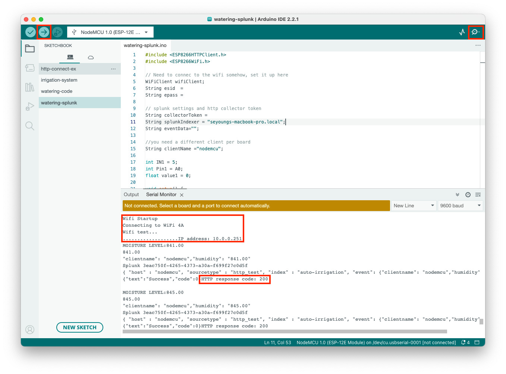

# Splunk For Health

- [DEMO video](https://www.youtube.com/shorts/tvo7LeyrJ0M)

This document provides a step-by-step tutorial on how to set up an automation system in which the humidifier and the fan is turned on whenever one of the measures hits the threshold, and all the data is gathered and seen in Splunk dashboard. Please note that the tutorial applies in **macOS** only and the following Arduino modules are required.

* ESP8266 NodeMCU([amazon](https://www.amazon.com/gp/product/B081CSJV2V/ref=ppx_yo_dt_b_asin_title_o01_s00?ie=UTF8&th=1))
* Micro USB Cable
* 5V Relay Module and Soil Moisture Sensor([amazon](https://www.amazon.com/gp/product/B07TMVNTDK/ref=ppx_yo_dt_b_asin_title_o07_s00?ie=UTF8&psc=1))
* Multicolored Dupont Wire([amazon](https://www.amazon.com/gp/product/B01EV70C78/ref=ppx_yo_dt_b_asin_title_o05_s00?ie=UTF8&psc=1))
* ELEGOO UNO Project Super Starter Kit([amazon](https://www.amazon.com/gp/product/B01D8KOZF4/ref=ppx_yo_dt_b_asin_title_o02_s00?ie=UTF8&psc=1)). For this project, the following modules are needed:
  * Breadboard
  * DHT11 Temperature and Humidity Module
  * Power Supply Module
  * 9V Battery with Snap-on Connector
  * Servo Motor SG90
  * Fan Blade and 3-6V Motor

This tutorial consists of four parts.

1. Set up Arduino components
2. Set up Arduino IDE
3. Set up Splunk on your laptop
4. Send data from Arduino to Splunk
5. Set up the dashboard

 

## 1. Set up Arduino components

### Place modules on the breadboard

Place the nodeMCU, DHT11 sensor, and power supply module on the breadboard.

### How to connect

* <b>NodeMCU <-----> DHT11 Temp/Humidity Sensor</b>
  - D7 <-----> S
  - 3V3 <-----> (+) 
  - GND <-----> (-)

* <b>NodeMCU <-----> 5V Relay Module</b>
  - D1 <-----> IN4
  - 3V3 <-----> VCC
  - GND <-----> GND

* <b>NodeMCU <-----> Servo Motor</b>
  - D4 <-----> Orange line
  - 3V3 <-----> Red line
  - GND <-----> Brown line

Plese refer to the ESP8266 NodeMCU kit pinout diagram below to find the right pin to connect.

* <b>5V Relay module <--> Fan module <--> Power Supply module</b>

I find the below image useful. Please ignore the connection with the UNO board in the image. 

## 2. Set up Arduino IDE

1. Download & install the Arduino IDE([official website](https://www.arduino.cc/en/software))
2. Open code
   - Go to **File** > **Open...** > choose "splunk-for-health.ino" (found in this repo) 
3. Get the ESP board manager extension
   - Go to **Arduino IDE** Menu > **Preferences** > **Settings**
   - Enter `http://arduino.esp8266.com/stable/package_esp8266com_index.json` in **Additional board manager URLs**
4. Download the esp8266 library
   - Go to **Tools** > **Board** > **Board Manager...** > Type "esp8266"
   - Install the **esp8266** library written by ESP8266 Community
   - 
5. Download the required libraries
   - Go to **Tools** > **Manage Libraries** > Type "DHT adafruit"
   - Install the **DHT sensor library** written by Adafruit
   - 
   - Go to **Tools** > **Manage Libraries** > Type "Servo Michael Margolis"
   - Install the **Servo** library written by Michael Margolis
   - 
6. Set up cofigurations to run your code on the ESP8266 nodeMCU
   - Select **Tools** > **Board** > **esp8266** > **NodeMCU 1.0 (ESP-12E Module)**
   - Select **Tools** > **Flash Size** > **4MB (FS:3MB OTA:~512KB)**
   - Select **Tools** > **CPU Frequency** > **80 MHz**
   - Select **Tools** > **Upload Speed** -> **921600**
   - Select **Tools** > **Port** > **/dev/cu.usbserial-0001** (whatever port that pops up when your ESP8266 nodeMCU is connected to your laptop)

## 3. Set up Splunk on your laptop

1. Go to the [Splunk official website](https://www.splunk.com/en_us/download.html), download, and install Splunk Enterprise.
   - Please refer to [the useful YouTube instruction](https://www.youtube.com/watch?v=DTzhK5txpQ8)
   - **IMPORTANT**: You might need to set up **SPLUNK_HOME** environment variable on your machine. Run the below command on your CLI.
     > `echo export 'SPLUNK_HOME="<directory path where your splunk file is located>"' >> ~/.zshrc`
   - To start Splunk, run `$SPLUNK_HOME/bin/splunk start`
2. Create an index (later used for searching your data)
   - Follow [the official instructions](https://docs.splunk.com/Documentation/Splunk/9.2.1/Indexer/Setupmultipleindexes#Create_events_indexes)
   - Please take my index setting as reference
   - 
3. Create a HTTP Event Collector(HEC) token on Splunk Enterprise
   - Follow [the official instructions](https://docs.splunk.com/Documentation/Splunk/9.1.1/Data/UsetheHTTPEventCollector?ref=hk#Create_an_Event_Collector_token_on_Splunk_Enterprise)
   - **WARNING**: do not click the **Enable indexer acknowledgment** checkbox
   - Please take my token setting as reference
   - 
   - To use the token, go to **Settings** > **Data inputs** > **HTTP Event Collector** > **Actions** column > click **Enable**
   - Copy the token value to `collectorToken` var on line 12 in `splunk-for-health.ino`
4. Enable HTTP Event Collector on Splunk Enterprise
   - Follow [the official instructions](https://docs.splunk.com/Documentation/Splunk/9.1.1/Data/UsetheHTTPEventCollector?ref=hk#Enable_HTTP_Event_Collector_on_Splunk_Enterprise)
   - Please take my setting as reference
   - 

## 4. Send data from Arduino to Splunk

1. In the Arduino IDE sketch board
   - Type the correct wifi id and password on line 8 and 9
   - Make sure that you choose the correct **Board** and **Port**
   - Click the "check" button on the top left corner of thethe Arduino sketch board to verify the code
   - Click the "right arrow" button on the top left corner of the Arduino sketch board to upload  and run the code
   - Click the "Serial Monitor" button on the top right corner. Confirm that wifi connection is successfully established and HTTP response code marks 200.
   - 

2. In Splunk Enterprise
   - Click **splunk>enterprise** logo on the top left corner
   - Choose **Search & Reporting** on the left menu
   - Type `index="temp-humid"` in the search bar and hit enter
   - Confirm the log data is stored and retrieved in Splunk Enterprise

## 5. Set up the dashboard

The example dashboard follows: 

